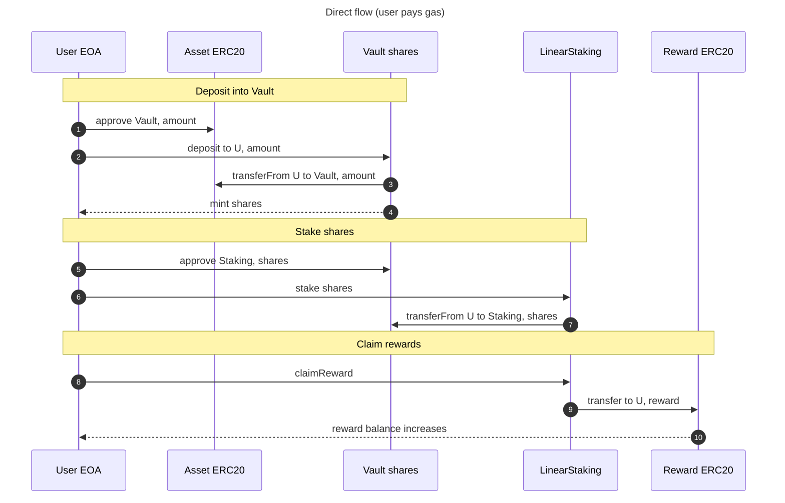
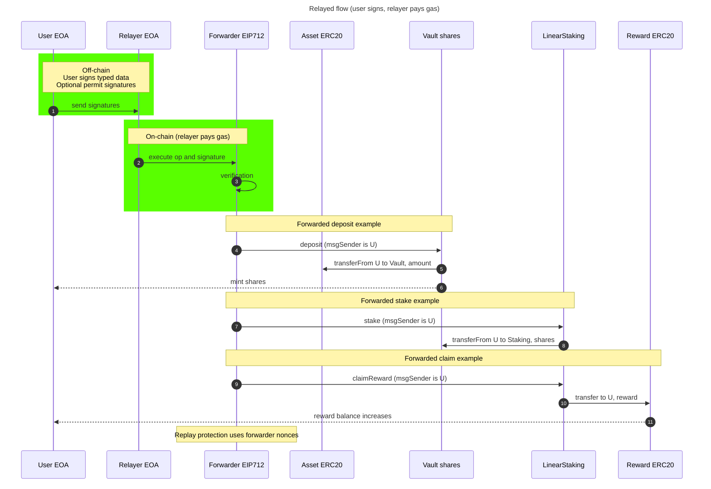

# Treasure Vault Protocol (Sepolia Demo)

Portfolio-grade demo of a minimal vault + staking protocol with **meta-transactions**.

- **Vault**: ERC4626-lite style vault shares (mint on deposit, burn on withdraw / redeem)
- **LinearStaking**: stake vault shares, accrue rewards linearly over time via an accumulator
- **Forwarder (EIP-712)**: relayer pays gas, user signs typed data (`execute(UserOp,sig)`)
- **ProtocolGovernor**: multi-owner governance gate for privileged actions (e.g. `setRewardRate`)

> This repo is a **demo / portfolio** project. It is **not** production-audited.





## Repo layout

- `src/`
  - `Vault.sol`
  - `LinearStaking.sol`
  - `Forwarder.sol`
  - `eip1167/` (clone logic)
  - `governance/` `mocks/` `libraries/` `interfaces/` `structs/`
- `test/`
  - `happy/` `fuzz/` `Invariants/` `PoC/` `workflow/`
- `script/DeploySepolia.s.sol` — Sepolia deployment script (broadcast + verify)
- `deployments/sepolia.json` — deployed addresses (source of truth)
- `scripts/relay.ts` — relayer demo (forwarded actions)
- `scripts/status.ts` — state inspector (one-shot view)

## Requirements

- Foundry
- Node.js + pnpm

## Setup

```bash
pnpm i
cp .env.example .env
```

Fill in `.env`

## Run tests (local)

```bash
forge test -vv
```
## Sepolia deployment(Deploy + verify)

```bash
make deploy-sepolia
```

### Deployed Info

Includes addresses and chainId that are saved in note: `deployments/sepolia.json`.

### Etherscan links

> Note: `VaultClone` is an **EIP-1167 minimal proxy** (clone). Etherscan may not match the clone bytecode directly.
> The canonical source lives at `VaultTemplate` (implementation).

```text
Forwarder        : https://sepolia.etherscan.io/address/0x65db83e93dC958dd5766e8cA014F88847707019C#code
ProtocolGovernor : https://sepolia.etherscan.io/address/0x20b443BDff623Fc2Cf222EF2970919291A38a599#code
VaultTemplate    : https://sepolia.etherscan.io/address/0xD0A58717C880ccdFFDBe3ceee2c18dd78233d03D#code
VaultFactory     : https://sepolia.etherscan.io/address/0xa1947fCfD27a965476ce7a48468C6b1B66e536ee#code
LinearStaking    : https://sepolia.etherscan.io/address/0x96aE8362aa05bF592c51E8b04e5DfE45f40bF74C#code
AssetToken       : https://sepolia.etherscan.io/address/0x6CCf1d69fEba6443fe08c8743bA9F4975270941E#code
RewardToken      : https://sepolia.etherscan.io/address/0x7126766f64EdEc247Bf7431792b284dBe4818843#code
VaultClone       : https://sepolia.etherscan.io/address/0x513896313649854066ffFF133c4d0C6e3183b0b9
```

## Direct flow (user pays gas)

```bash
make deposit
make stake
make unstake
make redeem
make claim
```

## Relayed flow (Forwarder / EIP-712)

User signs typed data off-chain, relayer pays gas on-chain.

```bash
make relay-deposit
make relay-stake
make relay-unstake
make relay-redeem
make relay-claim
```

## Status

Expected evidence after`(Direct flow / Relay flow)`:

```bash
make status
```

**Status format**
```text
Recommended fields to print (and verify):
user: 0x3312DFe46Bf20B5d7a2999e243e4Fe5bf9001d4b
fwd     nonce   = 
asset   tokens  = 
vault   shares  = 
staked  shares  = 
pending rewards = 
reward  tokens  = 
vault: 0x513896313649854066ffFF133c4d0C6e3183b0b9
totalUnderlying = 
totalSupply     = 
staking: 0x96aE8362aa05bF592c51E8b04e5DfE45f40bF74C
totalStaked     = 
```

## One-click commands (Makefile)

Minimum targets expected:

```text
make deploy-sepolia
make demo-direct
make demo-relay
make demo-all
```

## Security notes (demo scope)

**Saved in: SECURITY.md**

## License

MIT